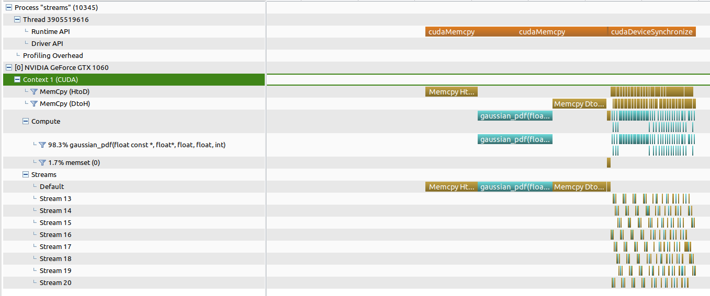

# Lesson 10 Notes

## Multithreading + CUDA Streams

- CUDA streams allow multiple threads to submit kernels for concurrent execution on a single GPU / multiple GPU
- Supported starting with CUDA 11.4/R470
- Worth it if each thread has enough work to offset kernel launch overhead
- Less efficient than saturating the device with streams from a single thread / saturating device with a single kernel

Example - Single GPU
```c++
cudaStream_t streams[num_streams];
for (int j=0; j<num_streams; j++)
cudaStreamCreate(&streams[j]);
#pragma omp parallel for
for (int i=0; i<N; i++) // execute concurrently across
{
    Kernel<<<b/N, t, 0, streams[i % num_streams]>>>(…); // threads + streams
}
```

Example - Multi-GPU (Should have at least 1 stream per GPU)
```c++
cudaStream_t streams[num_streams];
#pragma omp parallel for
for (int i=0; i<N; i++){
    int j = i % num_streams; // Stream number
    cudaSetDevice(j % num_gpus); // Round-robin across on-node GPUs
    cudaStreamCreate(&streams[j]); // Associated with device j % num_gpus
    Kernel<<<b/N, t, 0, streams[j]>>>(…);
} // execute across threads/streams/GPUs
```

## HW 10 Notes

Elapsed times where on the same order of magnitude, but streams was surprisingly faster, which was contrary to what the README stated.

```
non-stream elapsed time: 0.080624
streams elapsed time: 0.04505
```

Similar to exercise 7, with streams, there is overlap between the three components (HtoD, kernel, DtoH) as compared to large individual processes with no streams.


