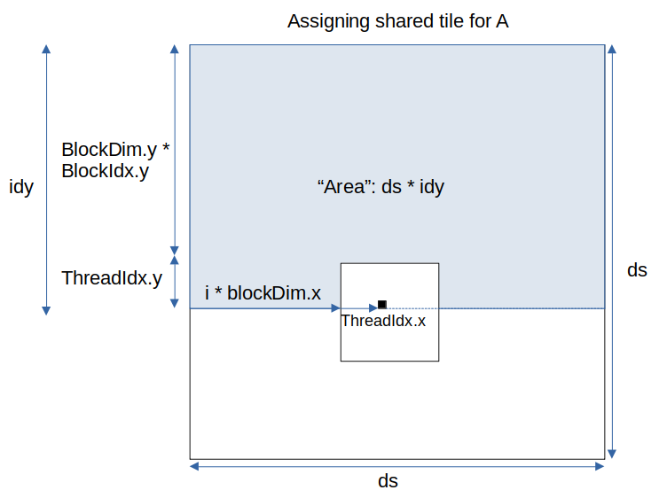
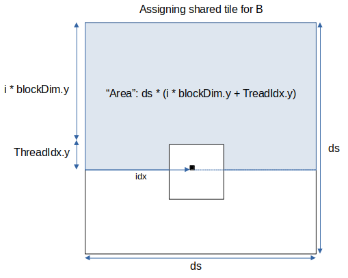

# Lesson 2 Notes

## Shared memory

 - Within a block, threads can share data via shared memory
 - Declared using `__shared__`, allocated per block
 - Not visible to threads in other blocks

## `void __syncthreads();`

 - Synchronizes all threads within a block
 - All threads must reach this barrier (make sure this statement is not skipped because of conditionals)

## Static vs Dynamic Shared Memory Allocation Example

**Static**

```
const int size = 48;

__global__ void k(...)
{
    __shared__ int temp[size];
}

k<<<grid, block>>>(...);
```

**Dynamic**

Need to provide third argument to kernel launch

```
__global__ void k(..., int shared_size_in_bytes)
{
    __shared__ int temp[];

    if(shared_size_in_bytes ...) ...
}

int shared_size_in_bytes = 192;
k<<<grid, block, shared_size_in_bytes>>>(..., shared_size_in_bytes);
```

## HW 2 Notes ##

Video [here](https://www.youtube.com/watch?v=Q3GgbfGTnVc) has a very good graphical explanation of the tiled approach to GPU matrix matrix multiplication.

Diagrams below shows how to get:
1. The corresponding element for matrix A for tiled element As[threadIdx.y][threadIdx.x]
2. The corresponding element for matrix B for tiled element Bs[threadIdx.y][threadIdx.x]




