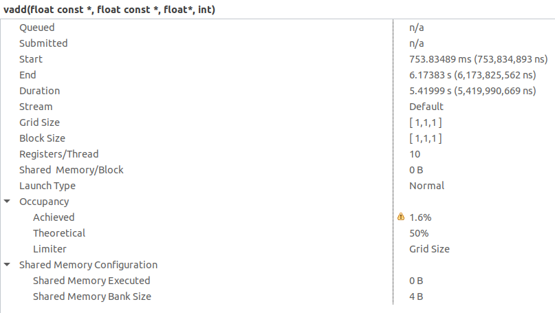
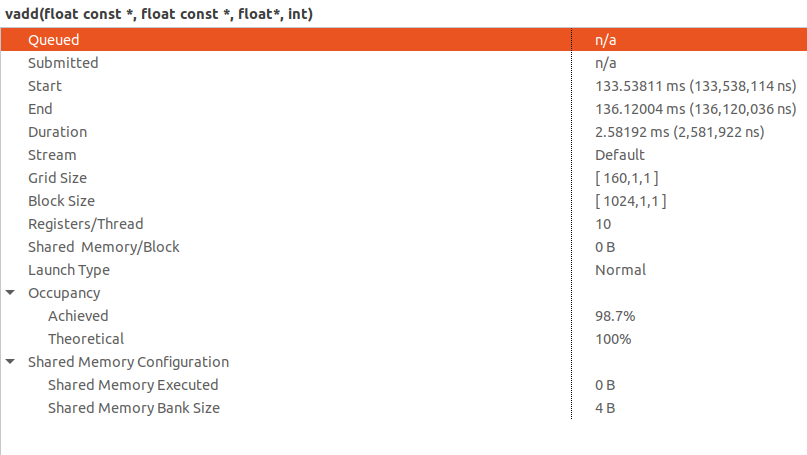

# Lesson 3 - Fundamental CUDA Optimization (Part 1)

## Execution Model

- SM: Streaming Multiprocessors
- Warps:
  - Thread blocks consists of warps (each warp has 32 threads)
  - A warp is executed physically in parallel (SIMD) on a multiprocessor

| Software    | Hardware | Explanation |
| -------- | ------- | ------- |
| Thread  | Scalar Processor    | Threads are exectued by scalar processors    |
| Thread Block | Multiprocessor     | <ul><li>Thread blocks are executed on multiprocessors</li><li>Thread blocks do not migrate</li><li>Several concurrent thread blocks can reside on one multiprocessor - limited by multiprocessor resources (shared memory and register file)</li> </ul>   |
| Grid    | Device    | A kernel is launched as a grid of thread blocks    |

## Launch Configuration

- Instructions are issued in order
- A thread stalls when one of the operands isn’t ready:
  - Memory read by itself doesn’t stall execution
- GPU is a massively thread-parallel, latency hiding machine
  - Latency is hidden by switching threads
- Need enough total threads to keep GPU busy
  - Typically need 512+ threads per SM
- Threadblock configuration
  - Threads per block should be a multiple of warp size (32)
  - SM can concurrently execute at least 16 thread blocks
    - Too small thread blocks: prevent achieving good occupancy
    - Too large thread blocks: less flexible
    - Could generally use 128-256 threads/block, but use whatever is best for the application
- Occupancy
  - A measure of the actual thread load in an SM, vs. peak theoretical/peak achievable
  - Achievable occupancy is affected by limiters to occupancy
  - Primary limiters
    - Registers per thread (can be reported by the profiler, or can get at compile time)
    - Threads per threadblock
    - Shared memory usage
- Kernel Launch Configuration
  - Launch enough threads per SM to hide latency
  - Launch enough threadblocks to load the GPU
- Use analysis/profiling when optimizing
  - Analysis-driven Optimization
  - Use Nsight Compute to show information about whether the compute
subsystem or the memory subsystem has been saturated

## HW 3 Notes

Refer the root README on how to launch Nvidia Visual Profiler.

To perform the profiling, use Nvidia Visual Profiler

Results for the ***vadd*** operation

**1 Block 1 Thread**

**1 Block 1024 Threads**

**160 Blocks 1024 Threads**

