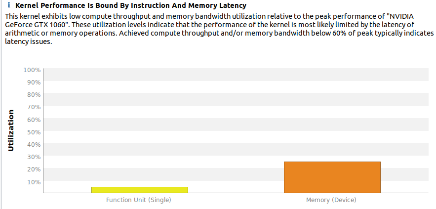

# Lesson 4 Notes

## Memory Heirarchy Overview

#### Local storage
- Each thread has its own local storage
- Typically registers (managed by the compiler)

#### Shared memory / L1
- Program configurable - typically up to 48KB shared
- Shared memory is accessible by threads in the same threadblock
- Very low latency
- Very high throughput: >1 TB/s

#### L2
- All access to global memory go through L2, including copies to/from CPU host

#### Global memory (GMEM)
- Accessible by all threads as well as host (CPU)
- High latency (hundreds of cycles)
- Throughput: up to 900 GB/s

## GMEM Operations

#### Load (retrive data)

Caching
- Default mode
- Attempts to hit L1, then L2, the GMEM
- **Load granularity is 128-byte line**

#### Store (write data)

Caching
- Invalidate L1 (since data has been changed), write-back for L2

Non-Caching
- Compile with `-Xptxas -dlcm=cg` option to nvcc
- Do not hit in L1, invalidate the line if it is in L1 already
- Direcly attempts to hit L2, then GMEM
- Load granularity is 32-bytes
- Uses: When working on multiple SMs, their L1 caches are not guaranteed to be in sync with one another

#### Load Operation in Detail

- Memory operations are issued per warp (32 threads)

Procedure:
1. Threads in a warp provide memory addresses
2. Determine how many line/segments are needed
3. Request the needed line/segments

Examples below assume a 448 byte cache (3.5 128-byte lines)

Example 1: Warp request 32 aligned, consecutive 4-byte words
- All data can be loaded within a single 128-byte line (coalescing)
- Bus utilization: 100%

Example 2: Warp request 32 aligned, permutated 4-byte words
- All data can be still be loaded within a single 128-byte line, just that they are not in sequence
- Bus utilization: 100%

Example 3: Warp request 32 misaligned, consecutive 4-byte words
- E.g. int c = a[idx-2]
- All data can be still be loaded with two 128-byte lines
- Bus utilization: 50% (takes 2 loads to fill up warp)

Example 4: All threads in a warp request the same 4-byte word
- Warp only needs 4 bytes
- The 4 byte word can be loaded within a single 128-byte line
- Bus utilization: 4 useful bytes / 128 bytes loaded = 3.125%

Example 5: Warp requests 32 scattered 4-byte words
- Addresses fall within N cache-lines
- Bus utilization: 128 useful bytes / (N * 128) bytes loaded

Example 6: Warp requests 32 scattered 4-byte words (non-caching load)
- Addresses fall within N cache-lines
- Recall that non-caching load reads 32-byte lines instead of 128 bytes
- Bus utilization: 128 useful bytes / (N * 32) bytes loaded --> Lower than caching load

#### GMEM Optimization Guildlines

- Strive for perfect coalescing
  - Align staring addresses - may require padding
  - A warp should access within a contiguous region
- Have enough concurrent accesses to saturate the bus
  - Process several elements per thread
    - Multiple loads get pipelined
    - Indexing calculations can often be reused
  - Launch enough threads to maximize throughput
    - Latency is hidden by switching threads (warps)
- Use all the caches

## Shared Memory

#### Uses

- Inter-thread communication within a block
- Cache data to reduce redundant global memory accesses
- Use it to improve global memory access patterns

#### Organization

- 32 banks, 4-byte wide banks
- Successive 4-byte words belong to different banks
- Can see shared memory as a 2D array, each row has 32 banks (columns) and number of rows is the amount that would fill the shared memory size (e.g. 48KB as mentioned above)
  - One bank (column) can have many values (based on the number of rows)
- Fastest to access the data "row-wise"

#### Bank Addressing

- No bank conflicts: Each thread accesses a different bank
- 2-way bank conflicts: Each bank has two threads accessing its data --> Data access twice as slow as ideal case
- Use padding to reduce bank conflicts (e.g. required for matrix transpose operations)

## HW 4 Notes

#### Indicing Diagram

#### Row Sum Statistics

#### Col Sum Statistics

#### Row Sum vs Col Sum

###### What similarities or differences do you notice between the *row_sum* and *column_sum* kernels?

Row sum operation was significantly slower than the column sum (51ms vs 6ms).

###### Do the kernels (*row_sum*, *column_sum*) have the same or different efficiencies? Why?

The column sum is more memory efficient compared to the row sum (~80% vs ~30%).

This is because column sum benefits from coalesced memory access across a warp. In the row sum case, each thread in the warp accesses a *ds* line of consecutive memory each in sequence. For example if there are 3 threads per warp and ds = 2, it would look like `0|0|1|1|2|2`. In the column sum case, for every iteration, when the threads in each warp accesses memory, the are adjacent to another. In this case, it would look like `0|1|2|0|1|2`. Hence, column sum is more memory efficient and faste than row sum.

**Useful advice**:
There's a simple rule that allows you to look at any complex indexing calculation and quickly determine if it will result in coalesced access or not. Assuming the indexing calculation involves threadIdx.x, if there is any multiplicative term on threadIdx.x (other than 1) then that is a bad pattern. We want threadIdx.x to be included in the indexing calculation only as an additive term, by itself. Row sum breaks this rule by multiplying threadIdx.x by n. Column sum includes threadIdx.x by itself as an additive term, so it is a good pattern. Referenced from [here](https://stackoverflow.com/questions/58780710/dont-understand-why-column-addition-faster-than-row-in-cuda#:~:text=Your%20column%2Dsumming%20case%20allows,row%20summing%20case%20breaks%20this.).
