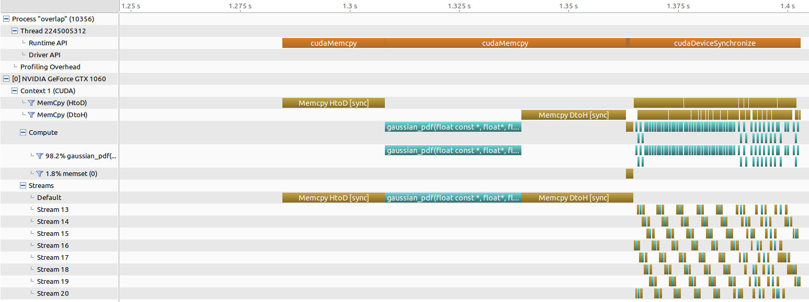

# Lesson 7 - CUDA Concurrency

## Pinned (non-pageable) Memory
- Pinned memory: Pin the data such that it cannot be moved down to the hard disk by the OS
- All memory that is to be copied to the GPU is pinned to the CPU
- Pageable memory: memory contents that can be paged in/out between DRAM and secondary storage device
  - Usual `cudaMalloc` uses pageable memory: Pageable memory -> Pinned memory -> GPU
- Usage
  - `cudaHostAlloc` / `cudaFreeHost` instead of malloc/free
  - `cudaHostRegister` / `cudaHostUnregister`: Pin regular memory already allocated with `malloc`

## Default CUDA API
- Kernel launches are asynchronous with CPU
- All CUDA calls are performed using a single default stream
- `cudaMemcpy` (D2H, H2D) block CPU thread

## Streams and Async Functionalities
- Streams: Sequence of operations that execute in issue-order on GPU
  - Operations from different streams can run concurrently
  - A kernel and memcopy from different streams may be interleaved
- `cudaMemcpyAsync` (D2H, H2D) asynchronous with CPU
- Ability to concurrently execute a kernel and a memcopy
- Concurrent copies in both directions (D2H, H2D) possible on most GPUs

## Stream Semantics
1. Two operations issued into the same stream will execute in issueorder. Operation B issued after Operation A will not begin to execute until Operation A has completed.
2. Two operations issued into separate streams have no ordering prescribed by CUDA. Operation A issued into stream 1 may execute before, during, or after Operation B issued into stream 2.

## Stream Creation and Copy/Compute Overlap
- Use `async` variants of CUDA calls where you can specify the stream to use
  - As opposed to the standard API which does
- Kernels can take in a 4th argument in its triple chevron syntax to specify the stream to use
- Place kernels and memcopy into different streams

Example:
```
cudaStream_t stream1, stream2;
cudaStreamCreate(&stream1);
cudaStreamCreate(&stream2);

...

// memcpy and kernel now may potentially overlap in execution
cudaMemcpyAysnc(dst, src, size, dir, stream1);
kernel<<<grid, block, 0, stream2>>>(...);


cudaStreamQuery(stream1); // test if stream is idle
cudaStreamSynchronize(stream2); // force CPU thread to wait
cudaStreamDestroy(stream2);

```

## Default Stream
- Kernels or `cudaMemcpy`… that do not specify stream (or use 0 for stream) are using the default stream
- All device activity issued prior to the item in the default stream must complete before default stream item begins
- All device activity issued after the item in the default stream will wait for the default stream item to finish
- **AVOID** using default stream during complex concurrency scenarios
- Converting back to using the default stream using `nvcc --default-stream per-thread …`

## Stream "Callbacks" (`cudaLaunchHostFunc`)
- Allows definition of a host-code function that will be issued into a CUDA stream
- Follows stream semantics: function will not be called until stream execution reaches that point
- Uses a thread spawned by the GPU driver to perform the work
- Useful for deferring CPU work until GPU results are ready
- **Limitation**:  Cannot use any CUDA runtime API calls (or kernel launches) in the function

## Using Streams with Managed Memory
- Follow same pattern, except use `cudaMemPrefetchAsync` instead of `cudaMemcpyAsync`
- However, additional computation has to be done for memory management, may result in unexpected gaps in timeline
- Stream semantics will guarantee that any needed migrations are performed in proper order
- Sometimes a busy stream may have a better throughput than idle stereams

## cudaEvent
- cudaEvent is an entity that can be placed as a “marker” in a stream
- A cudaEvent “recorded”: when it is issued
- A cudaEvent “completed”: when stream execution reaches the point where it was recorded
- Uses
  - Timing applications
  - Arranging complex concurrency scenarios

Example:
```
cudaEvent_t start, stop; // cudaEvent has its own type
cudaEventCreate(&start); // cudaEvent must be created
cudaEventCreate(&stop); // before use
cudaEventRecord(start); // “recorded” (issued) into default stream
Kernel<<<b, t>>>(…); // could be any set of CUDA device activity
cudaEventRecord(stop);
cudaEventSynchronize(stop); // wait for stream execution to reach “stop” event
cudaEventElapsedTime(&float_var, start, stop); // measure Kernel duration
```

## Multi-GPU: Device Management

#### Working with multiple GPUs
- Application can query and select GPUs
  - `cudaGetDeviceCount(int *count)`
  - `cudaSetDevice(int device)`
  - `cudaGetDevice(int *device)`
  - `cudaGetDeviceProperties(cudaDeviceProp *prop, int device)`
- Multiple host threads can share a device
- Single host thread can manage multiple devices
  - `cudaSetDevice` to set the current device to be used for the subsequent instructions

#### Streams with Multi-GPU
- Streams (and cudaEvent) have implicit/automatic device association
- Each device also has its own unique default stream
- Kernel launches will fail if issued into a stream not associated with current device
- `cudaStreamWaitEvent` can synchronize streams belonging to separate devices, `cudaEventQuery` can test if an event is “complete”

Example:
```
cudaSetDevice(0);
cudaStreamCreate(&stream0); //associated with device 0
cudaSetDevice(1);
cudaStreamCreate(&stream1); //associated with device 1
Kernel<<<b, t, 0, stream1>>>(…); // these kernels have the possibility
cudaSetDevice(0);
Kernel<<<b, t, 0, stream0>>>(…); // to execute concurrently
```

#### Device-to-Device Data Copying
- If system topology supports it, data can be copied directly from one device to another over a fabric (PCIE, or NVLink)
- Device must first be explicitly placed into a peer relationship (“clique”)
- Must enable “peering” for both directions of transfer (if needed)
- Thereafter, memory copies between those two devices will not “stage” through a system memory buffer (GPUDirect P2P transfer)

Example:
```
cudaSetDevice(0);
cudaDeviceCanAccessPeer(&canPeer, 0, 1); // test for 0, 1 peerable
cudaDeviceEnablePeerAccess(1, 0); // device 0 sees device 1 as a “peer”
cudaSetDevice(1);
cudaDeviceEnablePeerAccess(0, 0); // device 1 sees device 0 as a “peer”
cudaMemcpyPeerAsync(dst_ptr, 0, src_ptr, 1, size, stream0); //dev 1 to dev 0 copy
cudaDeviceDisablePeerAccess(0); // dev 0 is no longer a peer of dev 1
```

## Other Concurrency Scenarios

#### Host/Device execution concurrency
```
Kernel<<<b, t>>>(…); // this kernel execution can overlap with
cpuFunction(…); // this host code
```

#### Concurrent Kernels
- In practice, concurrent kernel execution on the same device is hard to witness
- Requires kernels with relatively low resource utilization and relatively long execution time
- There are hardware limits to the number of concurrent kernels per device
- Less efficient than saturating the device with a single kernel
- Best performance is still usually running a kernel at completely saturates the GPU instead of concurrent kernels

```
Kernel<<<b, t, 0, streamA>>>(…); // these kernels have the possibility
Kernel<<<b, t, 0, streamB>>>(…); // to execute concurrently
```

## Stream Priority
- CUDA streams allow an optional definition of a priority
- This affects execution of concurrent kernels (only)
- The GPU block scheduler will attempt to schedule blocks from high priority (stream) kernels before blocks from low priority (stream) kernels
- Current implementation only has 2 priorities
- Current implementation does not cause preemption of blocks

```
// get the range of stream priorities for this device
int priority_high, priority_low;
cudaDeviceGetStreamPriorityRange(&priority_low, &priority_high);
// create streams with highest and lowest available priorities
cudaStream_t st_high, st_low;
cudaStreamCreateWithPriority(&st_high, cudaStreamNonBlocking, priority_high);
cudaStreamCreateWithPriority(&st_low, cudaStreamNonBlocking, priority_low);
```

## HW 7 Notes

#### Overlap



- Non-stream timing: 77.876 ms
- Stream timing: 39.749 ms
- For the non-stream part of the program (first portion), there is no overlap between HtoD, kernel and DtoH
- For the stream part of the program, there is overlap between the three components, resulting in a execution time speed up

#### Simple Multi-GPU

- Note: As my laptop does not have multiple GPUs I do not have the results for this exercise
